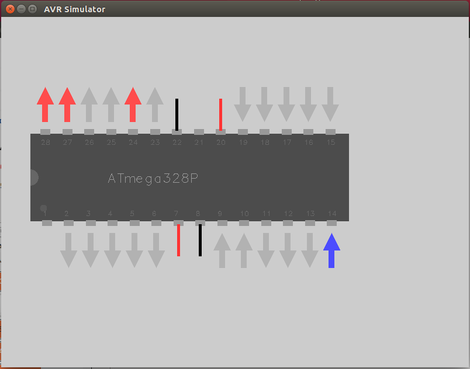

[](https://www.codacy.com/app/WayneBooth/gsimavr?utm_source=github.com&utm_medium=referral&utm_content=WayneBooth/gsimavr&utm_campaign=badger)
[](https://travis-ci.org/WayneBooth/gsimavr)
[](https://coveralls.io/r/WayneBooth/gsimavr?branch=master)

# gsimavr - A glut based simavr generic frontend

gsimavr is a gui wrapper around @buserror excellent [simavr](https://github.com/buserror/simavr). 
It uses GLUT to draw a representation of a uController, update outputs pins from simulator triggers, and prods the simulator when input pins are toggeled from the UI.
The GUI code has been specifically designed to be as low impact to your firmware as possible.



## Install and Requirements

Users should simply git clone this repo and copy the 'src' directory into a sub directory of their firmware. See [gsimavr-example](https://github.com/WayneBooth/gsimavr-example) for an example use. Finally add a single line to their makefile and install the supporting libraries:

* [simavr](https://github.com/buserror/simavr)
* GLUT

## How to use

* Clone this repository and copy the src directory into a sub directory of your firmware (we're assuming a directory of 'gui').
* Check your dependencies.
* run ```make```, to build the avr firmware.
* enter the 'gui' directory and run ```make```. This will compile and start the gui app.
  * The app will load the firmware from the parent directory as defined in the makefile *PROJECTNAME* variable.
  * The app will automatically configure input/output pins as defined by the firmware.
* How to use the gui:
  * Left click on an input to turn it on,
  * Right click on an input to turn it off,
  * Middle click on an input to connect it to a clock signal
* If you started the gui app with the ```-d``` parameter, it will wait for a gdb connection to localhost:1234
* it currently only supports the layout of an atmega328p, but it's super easy to add more MCUs.

## TODO

This first version has a lot of caveats:

* there is no analog represntation.
* pullup resistors are not considered.
* The GLUT implementation has a lot to be desired.
* I'm sure more...
